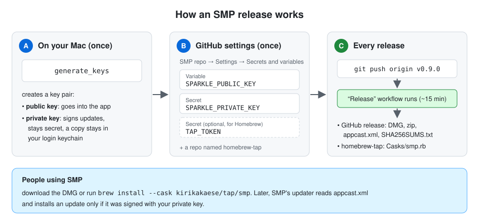
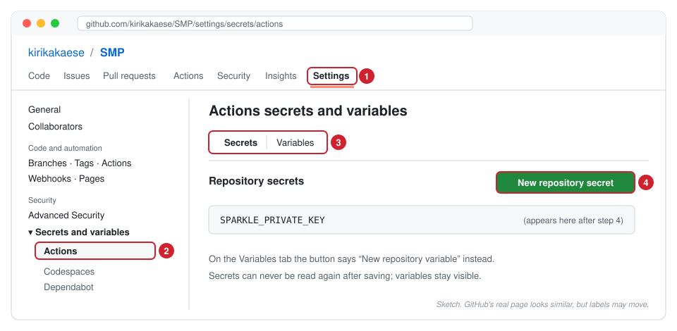
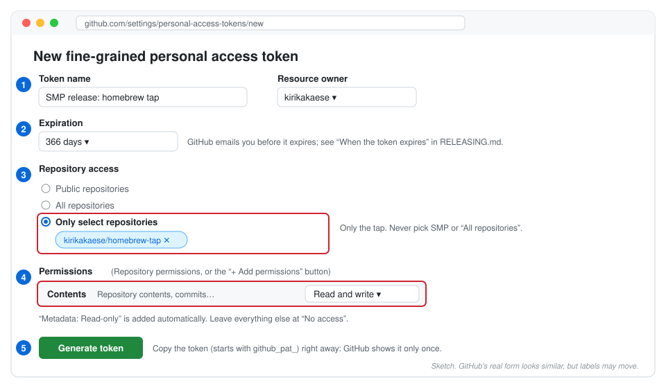

# Releasing SMP

This guide walks you through publishing an SMP release, one step at a time. GitHub Actions builds,
signs and publishes the release. Your Mac never uploads anything; you only push a tag.



- **Part A and Part B** are done **once**. Together they take about 15 minutes.
- **Part C** is done **for every release**.

Each step ends with a **✅ Done when** line, so you know you can move on.

**Contents**

- [Before you start](#before-you-start)
- [Part A: Create the update signing key (once)](#part-a-create-the-update-signing-key-once)
- [Part B: Set up the Homebrew tap (once, optional)](#part-b-set-up-the-homebrew-tap-once-optional)
- [Part C: Publish a release (every time)](#part-c-publish-a-release-every-time)
- [Beta releases](#beta-releases)
- [If something goes wrong](#if-something-goes-wrong)
- [Looking after the keys](#looking-after-the-keys)

---

## Before you start

You need:

- **Your Mac with Terminal.** It is in **Applications → Utilities → Terminal**, or press ⌘Space,
  type `Terminal` and press Return.
- **Your local copy of the SMP repository**, the folder you build SMP from in Xcode.
- **A browser where you are signed in to GitHub** as `kirikakaese`.

> **Tip for Terminal:** commands go in the grey boxes. Copy a whole box, paste it into Terminal and
> press Return. A line starting with `#` is a comment, and Terminal ignores it.

---

## Part A: Create the update signing key (once)

**Why:** SMP's built-in updater only installs an update that carries a valid signature. You create a
key pair:

- The **public key** is built into every copy of SMP, so the app can check signatures.
- The **private key** signs each release. Only you and the release workflow have it.

This uses [Sparkle](https://sparkle-project.org/), the update framework SMP is built with. Its
[documentation](https://sparkle-project.org/documentation/) (the part on EdDSA signatures)
explains the details if you are curious.

### Step A1: Download the Sparkle tools

Paste this into Terminal. It downloads the newest Sparkle release from
[github.com/sparkle-project/Sparkle/releases](https://github.com/sparkle-project/Sparkle/releases)
and unpacks it into `/tmp/sparkle`. Nothing is installed.

```sh
curl -fL -o /tmp/Sparkle.tar.xz \
  "$(curl -fsSL https://api.github.com/repos/sparkle-project/Sparkle/releases/latest \
     | grep -o 'https://[^"]*/Sparkle-[0-9.]*\.tar\.xz' | head -1)"
mkdir -p /tmp/sparkle && tar -xf /tmp/Sparkle.tar.xz -C /tmp/sparkle
ls /tmp/sparkle/bin
```

✅ **Done when** the last line lists `generate_keys` and `sign_update`, among others.

### Step A2: Create the key pair

```sh
/tmp/sparkle/bin/generate_keys
```

- macOS may ask whether `generate_keys` may use your keychain. Enter your Mac password and click
  **Always Allow**.
- The tool saves the private key in your **login keychain**, as an item named *"Private key for
  signing Sparkle updates"*.
- It then prints the public key, in a line like
  `<string>pfIShU4dEXqPd5ObYNfDBiQWcXozk7estwzTnF9BamQ=</string>`.

If you run it again later, it does not make a new key; it prints the existing one.

✅ **Done when** you see a message that a key was generated (or already exists) and a `<string>…</string>` line.

### Step A3: Add the public key to GitHub as a variable

1. Copy the public key to your clipboard:

   ```sh
   /tmp/sparkle/bin/generate_keys -p | pbcopy
   ```

2. Open **[SMP → Settings → Secrets and variables → Actions → Variables → New repository variable](https://github.com/kirikakaese/SMP/settings/variables/actions/new)**.
3. **Name:** `SPARKLE_PUBLIC_KEY`
4. **Value:** paste with ⌘V. It is about 44 characters and ends with `=`. Paste only the key, not
   `<string>` or any spaces.
5. Click **Add variable**.



*If the link doesn't open the form, click through the numbered parts of the sketch above:*

1. **Settings**
2. **Secrets and variables → Actions**
3. The **Variables** tab
4. **New repository variable**

✅ **Done when** [the Variables tab](https://github.com/kirikakaese/SMP/settings/variables/actions)
lists `SPARKLE_PUBLIC_KEY` with your key as its value.

### Step A4: Add the private key to GitHub as a secret

1. Export the private key to a temporary file, copy it, then delete the file right away:

   ```sh
   /tmp/sparkle/bin/generate_keys -x /tmp/sparkle-private-key.txt
   pbcopy < /tmp/sparkle-private-key.txt
   rm /tmp/sparkle-private-key.txt
   ```

2. Open **[SMP → Settings → Secrets and variables → Actions → New repository secret](https://github.com/kirikakaese/SMP/settings/secrets/actions/new)**
   (steps 1, 2 and 4 in the sketch above, on the **Secrets** tab).
3. **Name:** `SPARKLE_PRIVATE_KEY`
4. **Secret:** paste with ⌘V.
5. Click **Add secret**.
6. Clear the clipboard, so the key isn't pasted somewhere by accident later:

   ```sh
   pbcopy < /dev/null
   ```

GitHub never shows a secret again after you save it, not even to you. That's expected. The copy
in your keychain (Step A2) stays your master copy.

✅ **Done when** [the Secrets tab](https://github.com/kirikakaese/SMP/settings/secrets/actions)
lists `SPARKLE_PRIVATE_KEY`.

**Part A is finished.** Releases already work now. Part B is only for Homebrew.

---

## Part B: Set up the Homebrew tap (once, optional)

**Why:** A *tap* is a GitHub repository that Homebrew can install apps from
([Homebrew's docs on taps](https://docs.brew.sh/Taps)). With it, anyone can install SMP with:

```sh
brew install --cask kirikakaese/tap/smp
```

After every stable release, the release workflow writes the new version into the tap. It needs a
token that is allowed to change **only** that one repository.

If you skip Part B, releases still work; the workflow just notes that it skipped the tap.

### Step B1: Create the `homebrew-tap` repository

1. Open **[github.com/new](https://github.com/new)**.
2. **Owner:** `kirikakaese`. **Repository name:** `homebrew-tap`. The name must be exactly this:
   Homebrew turns `kirikakaese/homebrew-tap` into the short name `kirikakaese/tap`.
3. Select **Public**.
4. Switch on **Add a README file**. This matters: the workflow can't push to a completely empty
   repository.
5. Click **Create repository**.

✅ **Done when** [github.com/kirikakaese/homebrew-tap](https://github.com/kirikakaese/homebrew-tap) shows a README.

### Step B2: Create a token for the tap

1. Open **[Settings → Developer settings → Fine-grained tokens → Generate new token](https://github.com/settings/personal-access-tokens/new)**.
2. Fill in the form as in the sketch below:

   | Field | Value |
   | --- | --- |
   | Token name | `SMP release: homebrew tap` (any name works) |
   | Resource owner | `kirikakaese` |
   | Expiration | as long as you like, for example 366 days |
   | Repository access | **Only select repositories** → `kirikakaese/homebrew-tap` |
   | Permissions | **Contents → Read and write**. In some layouts, click **+ Add permissions** first and pick **Contents**. Leave everything else as it is. |

3. Click **Generate token**.
4. Click the copy icon next to the token. It starts with `github_pat_`, and GitHub shows it **only
   once**.



✅ **Done when** the token is on your clipboard.

### Step B3: Add the token to SMP as a secret

1. Open **[SMP → New repository secret](https://github.com/kirikakaese/SMP/settings/secrets/actions/new)**.
2. **Name:** `TAP_TOKEN`
3. **Secret:** paste with ⌘V.
4. Click **Add secret**.

✅ **Done when** [the Secrets tab](https://github.com/kirikakaese/SMP/settings/secrets/actions)
lists both `SPARKLE_PRIVATE_KEY` and `TAP_TOKEN`.

**Part B is finished.** The one-time setup is complete.

---

## Part C: Publish a release (every time)

### Step C1: Update your local `main`

In Terminal, go to your SMP folder. Type `cd `, with a space after it, then drag the SMP folder from
Finder into the Terminal window and press Return. Then run:

```sh
git checkout main
git pull
git log --oneline -1
```

✅ **Done when** the last line shows the newest commit on
[GitHub's main branch](https://github.com/kirikakaese/SMP/commits/main).

### Step C2: Choose the version number

Version numbers look like `MAJOR.MINOR.PATCH`, with the letter `v` in front of the tag:

| You are releasing | Tag |
| --- | --- |
| The first public version | `v0.9.0` |
| Bug fixes only | raise the last number: `v0.9.1` |
| New features | raise the middle number: `v0.10.0` |
| A test version for opted-in users | add `-beta.N`: `v0.10.0-beta.1` (see [Beta releases](#beta-releases)) |

Each version can be released only once, so never reuse a tag.

### Step C3: Create the tag and push it

Replace `v0.9.0` with your version in both lines:

```sh
git tag v0.9.0
git push origin v0.9.0
```

Pushing the tag is what starts the release. Nothing happens on GitHub until then.

✅ **Done when** Terminal shows `* [new tag]  v0.9.0 -> v0.9.0`.

### Step C4: Watch the release workflow

1. Open **[Actions → Release](https://github.com/kirikakaese/SMP/actions/workflows/release.yml)**.
   The top run has the tag name, and a yellow dot means it is running.
2. Click the run, then **Build and publish**, to watch each step live. A run takes about 10–20
   minutes. The steps are:
   1. **Version:** checks the tag. The build number is the number of commits, so it always grows.
   2. **Check the signing setup:** stops with a clear message if Part A is missing.
   3. **Build:** a universal app (Apple silicon and Intel).
   4. **Re-sign the app ad-hoc:** every part, including the Sparkle framework, gets the same
      ad-hoc signature, so macOS agrees to load them together.
   5. **Verify the app:** signatures, both architectures, version number and update key.
   6. **Launch the app:** starts SMP for 15 seconds to prove it opens.
   7. **Package:** `SMP-<version>.dmg`, `SMP-<version>.zip` and `SHA256SUMS.txt`.
   8. **Sign the update and write the appcast:** signs the zip with your private key and adds it to
      `appcast.xml`, the list of versions SMP's updater reads.
   9. **Publish the release:** creates the GitHub release with all files and notes.
   10. **Update the Homebrew tap:** stable releases only, and only if Part B is done.

✅ **Done when** the run has a green check mark. If it is red, see
[If something goes wrong](#if-something-goes-wrong).

### Step C5: Check the result

1. **The release:** open [Releases](https://github.com/kirikakaese/SMP/releases). The new release
   lists `SMP-<version>.dmg`, `SMP-<version>.zip`, `appcast.xml` and `SHA256SUMS.txt`.
2. **The app:**
   1. Download the DMG, open it and drag SMP to Applications.
   2. The first time you open SMP, macOS blocks it, because it isn't notarized by Apple (that needs
      a paid developer account). Click **Done**.
   3. Open **System Settings → Privacy & Security** and scroll down to the message about SMP.
   4. Click **Open Anyway** and confirm with your password.

   [Apple's guide](https://support.apple.com/guide/mac-help/open-a-mac-app-from-an-unknown-developer-mh40616/mac)
   shows the same steps with screenshots. You only do this once per Mac; later versions install
   through SMP's own updater.
3. **The updater:** in SMP, open **Settings → Updates**. It shows the update settings and a
   **Check Now** button, rather than the "not made by the release workflow" message.
4. **Homebrew** (if you did Part B):
   1. [The tap](https://github.com/kirikakaese/homebrew-tap/tree/main/Casks) now has `Casks/smp.rb`
      with the new version.
   2. On a Mac with Homebrew, try `brew install --cask kirikakaese/tap/smp`. The first launch needs
      **Open Anyway** there too.

✅ **Done when** SMP opens and Settings → Updates offers **Check Now**.

**How updates reach people:** at the next check, an installed SMP finds the new version in the
latest release's `appcast.xml`. It verifies the signature and offers the update. You can test this
for real once v0.9.1 is out, on a Mac running v0.9.0.

---

## Beta releases

1. Tag a version with `-beta.N`, for example `v0.10.0-beta.1`, and push it as in Step C3.
2. The workflow publishes the beta as a **pre-release** on GitHub.
3. It also adds the beta to the newest stable release's `appcast.xml`, but marked as a beta.
4. Only people who switched on **Settings → Updates → Include beta versions** are offered it.
5. Betas don't change the Homebrew tap.

When the beta is good, release the same version without the suffix, for example `v0.10.0`.

---

## If something goes wrong

Click the red step in the workflow run to read its error. The most common ones:

| Error message (or symptom) | What it means | Fix |
| --- | --- | --- |
| `Set the repository variable SPARKLE_PUBLIC_KEY` | Step A3 is missing or the name is misspelled | Do Step A3, then **Re-run jobs** (top right of the run) |
| `Add the repository secret SPARKLE_PRIVATE_KEY` | Step A4 is missing or the name is misspelled | Do Step A4, then **Re-run jobs** |
| `Release tags must look like v1.2.3 or v1.2.3-beta.1` | The tag has the wrong format | Delete the tag (below) and push a correct one |
| **Verify the app** fails at `SUPublicEDKey` | The variable has extra characters, for example `<string>` or a space | Fix the variable's value, then **Re-run jobs** |
| **Verify the app** says something `is not ad-hoc signed`, or **Launch the app** says `SMP quit within 15 seconds` | The bundle's signatures don't fit together, so macOS would refuse to start SMP | Nothing to change in the settings: the code needs a fix. Delete the tag (below) and report the error |
| **Sign the update** fails | The secret isn't the exported private key | Repeat Step A4 (it overwrites the secret), then **Re-run jobs** |
| `TAP_TOKEN is not set` (a notice, not an error) | Part B is skipped | Nothing, or do Part B before the next release |
| **Update the Homebrew tap** fails with `Permission to kirikakaese/homebrew-tap.git denied` or `403` | The token can read the tap but not write to it: **Repository access** isn't *Only select repositories → homebrew-tap*, or **Contents** isn't *Read and write* | On [your fine-grained tokens](https://github.com/settings/personal-access-tokens), click the token, then **Edit**. Fix both settings as in Step B2 and click **Update**. The token itself stays the same, so `TAP_TOKEN` needn't change. Then **Re-run jobs** |
| **Update the Homebrew tap** fails with `Authentication failed` | The token expired or was deleted | Make a new token (Step B2), replace `TAP_TOKEN` (Step B3), then **Re-run jobs** |

**Re-run jobs** works when the code is fine and only a setting was missing. If the release was
already published, a re-run replaces its files instead of failing. If the code needs
fixing, first delete the release and the tag:

1. If a release was created, open it on the [Releases](https://github.com/kirikakaese/SMP/releases)
   page and click the trash icon to delete it.
2. Delete the tag, on GitHub and on your Mac:

   ```sh
   git push origin --delete v0.9.0
   git tag -d v0.9.0
   ```

3. Fix the problem on `main`, then repeat Part C from Step C1.

---

## Looking after the keys

- **The Sparkle private key is irreplaceable.**
  - Every installed copy of SMP only trusts updates signed with it.
  - If you lose it, existing users can't update automatically any more. They would have to download
    a new version by hand.
  - It lives in your login keychain, as *"Private key for signing Sparkle updates"*, and is
    included in your normal Mac backups (for example Time Machine).
  - You can also keep a copy in a password manager: export it again as in Step A4.
- **If the private key leaks,** someone could sign fake updates. Plan a key rotation right away:
  Sparkle supports moving to a new key
  (see "rotating keys" in [Sparkle's documentation](https://sparkle-project.org/documentation/)).
- **When the token expires,** GitHub emails you beforehand. Create a new one (Step B2) and replace
  the `TAP_TOKEN` secret (Step B3). Opening the existing secret and clicking **Update secret** works
  too.
- **Never** put either key or the token into a file in the repository, an issue, a pull request or
  a chat.
